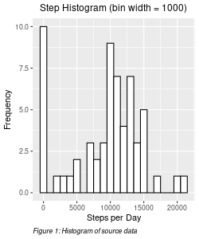
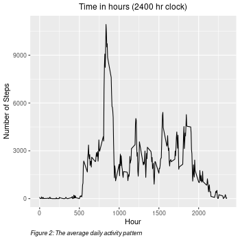
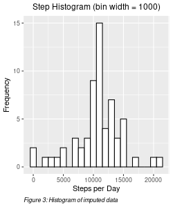
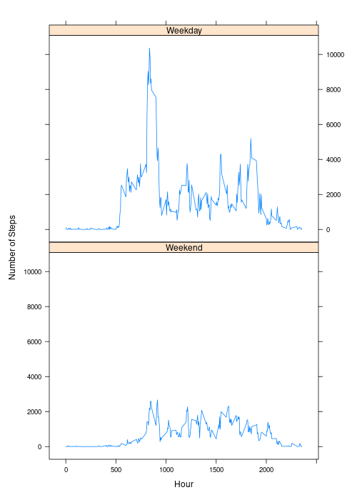

<!-- number_sections: true -->

# Assignment 1: Activity Analysis

## Assignment Requirements

1. Loading and preprocessing the data
    1. Show any code that is needed to
        1. Load the data (i.e. read.csv())
        2. Process/transform the data (if necessary) into a format suitable for 
        your analysis

2. Question: What is mean total number of steps taken per day?
    1. Make a histogram of the total number of steps taken each day
    2. Calculate and report the mean and median total number of steps taken
    per day

3. Question: What is the average daily activity pattern?
    1. Make a time series plot of the 5-minute interval and the average number 
    of steps taken, averaged across all days
    2. Question: Which 5-minute interval, on average across all the days in the 
    dataset, contains the maximum number of steps?

4. Imputing missing values
    1. Calculate and report the total number of missing values in the dataset
    2. Devise a strategy for filling in all of the missing values in the dataset. 
    The strategy does not need to be sophisticated.
    3. Create a new dataset that is equal to the original dataset but with the 
    missing data filled in.
    4. Make a histogram of the total number of steps taken each day and 
    5. Calculate and report the mean and median total number of steps taken per 
    day. 
    6. Question: Do these values differ from the estimates from the first part 
    of the assignment?
    7. QuestionWhat is the impact of imputing missing data on the estimates of 
    the total daily number of steps?

5. Question: Are there differences in activity patterns between weekdays and 
week-ends?
    1. Create a new factor variable in the dataset with two levels – “weekday”
    and “weekend.”
    2. Make a panel plot containing a time series plot (i.e. type = "l") of the
    5-minute interval and the average number of steps taken, averaged across all 
    weekday days or weekend days.

    
## Assignment Configuration

To run the code, the following libraries must be loaded:


```r
library(dplyr)
```

```
## 
## Attaching package: 'dplyr'
```

```
## The following objects are masked from 'package:stats':
## 
##     filter, lag
```

```
## The following objects are masked from 'package:base':
## 
##     intersect, setdiff, setequal, union
```

```r
library(ggplot2)
library(gridExtra)
```

```
## 
## Attaching package: 'gridExtra'
```

```
## The following object is masked from 'package:dplyr':
## 
##     combine
```

```r
library(grid)
library("lattice")
```

## Assignment Responses

<!-- *********************************************************************** -->
<!-- *********************************************************************** -->
<!-- *********************************************************************** -->
<!-- *********************************************************************** -->

### 1 Load and preprocess data

#### Load the data (i.e. read.csv())

* read the activity.csv file
    + store in **sourceData**

#### Process/transform the data

* Transform data for the analysis into a format suitable for your analysis
    + Generate subgroups of **sourceData**
        + Group **sourceData** by date and summarize by steps to create number  
        of steps per date **dailySourceSteps** for section 2 What is mean total 
        number of steps taken per day?
        + Group **sourceData** by interval to create **intervalSource** this is 
        used in sections 1 Load and preprocess data and 3 What is the average 
        daily activity pattern?
            + Summarize the steps in **intervalSource** to create
            **intervalSourceSteps** this is used in sections 1 Load and 
            preprocess data and 3 What is the average daily activity pattern?
            + Summarize the steps in **intervalSource** to create
            **intervalSourceMean** this is used in section 1 Load and 
            preprocess data to create imputed data
    + Create **imputedData** data.frame (imputation strategy is described in
    section 4 Imputing missing values)
    + Generate subgroups of **imputedData**
        + Group **imputedData** by date and summarize by steps to create number  
        of steps per date **dailyImputedSteps** for section 4 Imputing missing
        values?
    + Add Weekday/Weekend categorical variable to **imputedData**
    + Generate subgroups of **imputedData** WeekendData consisting of all data
    points occuring on the weekend and WeekdayData consisting of all data
    points occuring on the weekday.
        + Generate **intervalWeekend** from **imputedData**. This contains the
        total steps per day for weekend interval
        + Generate **intervalWeekday** from **imputedData**. This contains the
        total steps per day for weekday interval
        + Generate **intervalWeekendTotal** from **intervalWeekend**. This 
        contains the total steps per day for weekend days
        + Generate **intervalWeekdayTotal** from **intervalWeekday**. This 
        contains the total steps per day for weekday days


```r
# ##############################################################################
#    Load the data  ************************************************************
# ##############################################################################
sourceData           <- read.csv('activity.csv', header = TRUE)

# ##############################################################################
#    Generate data frames derived from sourceData    ***************************
# ##############################################################################
dailySourceSteps  <- sourceData %>% group_by(date) %>%
    summarise(total = sum(steps, na.rm = TRUE))

intervalSource          <- sourceData %>% group_by(interval)

intervalSourceSteps     <- intervalSource %>%
    summarise(total = sum(steps, na.rm = TRUE))

intervalSourceMean      <- intervalSource    %>%
    summarise(mean = mean(steps, na.rm = TRUE))


# ##############################################################################
#    Create and store imputed data   *******************************************
# ##############################################################################
imputedData <- data.frame(sourceData)
for (interval in 1:288)
{
    meanStep <- mean(intervalSourceMean$mean[interval])

    for (day in 1:61)
    {
        idx <- interval + 288 * (day - 1)

        if (is.na(imputedData$step[idx])) {
            imputedData$steps[idx] <- meanStep
        }
     }
}

# ##############################################################################
#    Generate data frames derived from imputedData    **************************
# ##############################################################################
dailyImputedSteps  <- imputedData %>% group_by(date) %>%
    summarise(total = sum(steps, na.rm = FALSE))

intervalImputedSteps  <- imputedData %>% group_by(interval) %>%
    summarise(total = sum(steps, na.rm = FALSE))


# ##############################################################################
#    Add a categorical variable day to imputedData   ***************************
# ##############################################################################
weekendDays       <- list("Sunday", "Saturday")
x   <- list()
for (i in 1:length(imputedData$interval)) {
    if (weekdays(as.Date(imputedData$date[i])) %in% weekendDays)
    {
        x <- append(x, "Weekend")
    } else {
        x <- append(x, "Weekday")
    }
}

imputedData$day <- factor(x, levels = c("Weekend", "Weekday"))

# ##############################################################################
#    Add a categorical variable day to imputedData   ***************************
# ##############################################################################
weekendData <- subset(imputedData, day=="Weekend")
weekdayData <- subset(imputedData, day=="Weekday")

intervalWeekend <- weekendData %>%
    group_by(interval) %>% summarise(steps = sum(steps))

intervalWeekday <- weekdayData %>%
    group_by(interval) %>% summarise(steps = sum(steps))

intervalAll <- imputedData %>%
    group_by(interval, day) %>% summarise(steps = sum(steps))
```

```
## `summarise()` has grouped output by 'interval'. You can override using the
## `.groups` argument.
```

```r
intervalWeekendTotal = sum(intervalWeekend$steps)
intervalWeekdayTotal = sum(intervalWeekday$steps)
```

<!-- *********************************************************************** -->
<!-- *********************************************************************** -->
<!-- *********************************************************************** -->
<!-- *********************************************************************** -->
<br/>
<hr/>
<br/>

### 2 What is the mean total number of steps taken per day?

* Make a histogram of the total number of steps taken each day
* Calculate and report the mean and median total number of steps taken per day

#### Make a histogram of the total number of steps taken each day


```r
png("figure/dailySourceSteps.png", width = 250, height = 300, units = "px",
    type = "cairo-png")

ggplot(dailySourceSteps, aes(x = total)) +
    geom_histogram(aes(y = ..count..), color="black", fill="white",
                   binwidth = 1000) +
    labs(title="Step Histogram (bin width = 1000)", x = "Steps per Day",
         y = "Frequency", caption = "Figure 1: Histogram of source data") +
    theme(plot.title = element_text(size=12, hjust = 0.5),
          plot.caption = element_text(face = "italic", hjust = 0.0))

dev.off()
```

png 
  2 



#### Calculate and report the mean and median total number of steps taken per day

The mean number of steps per day is 
[9354]{style="color:green; font-weight: bold"}.
The median number of steps per day is [
10395.00]{style="color:green; font-weight: bold"}.

<!-- *********************************************************************** -->
<!-- *********************************************************************** -->
<!-- *********************************************************************** -->
<!-- *********************************************************************** -->
<br/>
<hr/>
<br/>

### 3 What is the average daily activity pattern?

*   Make a time series plot of the 5-minute interval (x-axis) and the average 
number of steps taken, averaged across all days (y-axis)
*   Which 5-minute interval, on average across all the days in the dataset, 
contains the maximum number of steps?


```r
png("figure/timeSeriesSource.png", width = 350, height = 350, type = "cairo-png")

ggplot(intervalSourceSteps, aes(x = interval, y = total)) +
    geom_line() +
    labs(title="Time in hours (2400 hr clock)", x = "Hour", 
         y = "Number of Steps", 
         caption = "Figure 2: The average daily activity pattern") +
    theme(plot.title = element_text(size=12, hjust = 0.5),
          plot.caption = element_text(face = "italic", hjust = 0.0))

dev.off()
```

png 
  2 

```r
idx = which.max(intervalSourceSteps$total)
maxInterval = intervalSource$interval[idx]
```



The interval with the largest number of steps is 
[835]{style="color:green; font-weight: bold"}.

<!-- *********************************************************************** -->
<!-- *********************************************************************** -->
<!-- *********************************************************************** -->
<!-- *********************************************************************** -->
<br/>
<hr/>
<br/>

### 4 Imputing missing values

* Calculate and report the total number of missing values in the dataset
* Devise a strategy for filling in all of the missing values in the dataset.
* Create a new dataset that is equal to the original dataset but with the
missing data filled in.
* Make a histogram of the total number of steps taken each day
* Calculate and report the mean and median total number of steps taken per day. 

**Do these values differ from the estimates from the first part of the assignment?**

**What is the impact of imputing missing data on the estimates of the total daily 
number of steps?**

<br/>

#### Report the total number of missing values


```r
nNAValues          <- sum(is.na(sourceData$steps))
```

The number of missing data is [
2304]{style="color:green; font-weight: bold"}.

<br/>

#### Devise a filling strategy

The code to create the imputed data is found in Section 1: Load and Preprocess
Data. The strategy used to replace the NA values is as follows:

1. Let the matrix **imuptedData** be a copy of **sourceData** organized in 288 
rows (the number of intervals) and 61 columns (the number of days).

1. For each row, 
    1. Calculate the mean value of the row of **M** ignoring the NA values. This 
    value is stored in the variable **meanStep**.
    1. Loop through the row and replace the an NA's in the row with 
    **meanStep**.

1. Once the loop is complete, **imputedData** will no longer have NA values.

#### Create an imputed dataset

The imputed data set and its derivitives are generated in the "Load and
preprocess data" section under *Generate imputed data*. This imputedData 

#### Make a histogram of the total number of steps taken each day


```r
png("figure/imputedSteps.png", width = 250, height = 300, type = "cairo-png")

ggplot(dailyImputedSteps, aes(x = total)) +
    geom_histogram(aes(y = ..count..), color="black", fill="white",
                   binwidth = 1000) +
    labs(title="Step Histogram (bin width = 1000)", x = "Steps per Day",
         y = "Frequency", caption = "Figure 3: Histogram of imputed data") +
    theme(plot.title = element_text(size=12, hjust = 0.5),
          plot.caption = element_text(face = "italic", hjust = 0.0))

dev.off()
```

png 
  2 



#### Calculate and report the mean and median total number of steps taken per day**

The mean number of steps per day is [
10766.19]{style="color:green; font-weight: bold"}


The median number of steps per day is [
10766.19]{style="color:green; font-weight: bold"}.

<br/>

***Do these values differ from the estimates from the first part of the
assignment?***

The first part estimated the mean and median as [9354]{style="color:green; font-weight: bold"} and [10395]{style="color:green; font-weight: bold"} respectively.

From this we can conclude the mean value and median have shifted to a slightly 
larger value. This makes sense since the NA values were replaced by small 
positive values so we should expect the mean and median to increase.


***What is the impact of imputing missing data on the estimates of the total
daily number of steps?***

Imputing the missing data increases the total number of steps taken per day. 
This can be seen in the respective graphs and the mean values for both source
and imputed data. 

<!-- *********************************************************************** -->
<!-- *********************************************************************** -->
<!-- *********************************************************************** -->
<!-- *********************************************************************** -->
<br/>
<hr/>
<br/>


### 5 Differences in activity patterns weekdays vs weekends?

* Create a new factor variable in the dataset with two levels -- "weekday" and
"weekend" indicating whether a given date is a weekday or weekend day.
* Make a panel plot containing a time series plot of the 5-minute interval 
(x-axis) and the average number of steps taken, averaged across all weekday days 
or weekend days (y-axis). The plot should look something like the following, which was created using simulated data:

#### Create a new factor variable

The details and code for this are in **1 Load and preprocess data**. The code is
in the section **Add a categorical variable day to imputedData**. 


#### Make a panel plot containing a time series plot of the 5-minute interval


```r
png("figure/imputedTS.png", width = 500, height = 700, type = "cairo-png")

xyplot(steps ~ interval | day,
       data = intervalAll,
       layout = c(1, 2),
       type = "l",
          xlab = "Hour", ylab = "Number of Steps")

dev.off()
```

png 
  2 



<br/>

These graphs provide a lot of information regarding the subjects walking habits
so we there are a lot aspects to the question "*Are there differences in activity 
patterns between weekdays and week-ends?*"  

The first question we should ask is, are there a different number of steps taken
during the weekend versus weekdays. Since there are 5 weekdays and 2 weekend
days the ratio of weekday and weekend steps should be 2.5 : 1.0. The value of 
the number of steps during the weekday and the number during weekends was 
calculated in **Section 1, Load and preprocess.** The number of steps during the
weekday is *integralWeekdaySteps* and *integralWeekendSteps* during the weekend.

From the earlier computations, we get: 

*integralWeekdaySteps* = 461513  
*integralWeekendSteps* = 195224

and the ratio of weekday and weekend steps is [ 
2.36
]{style="font-weight: bold"}

The value of the expected result 2.5 and the actual result, 2.36 are close, 
which suggests the subject is consistent in the amount she walks on a daily 
basis.

**Patterns**

1. The subject appears to be inactive (sleeping) from about 2230 (10:30 PM) to
0500 (5:00 AM) on weekdays and from 2330 (11:30 PM) to 0500 (5:00 AM) on 
weekends.
    1. During weekdays, the time between the beginning of activity to fully
    active is roughly 30 - 60 minutes, whereas the beginning of activity to 
    fully active on the weekends is roughy 120 - 180 minutes with a 
    comparitively slow ramp. 
    2. During weekdays, the subject's activity was relatively constrained when
    compared to the weekend's activity.


